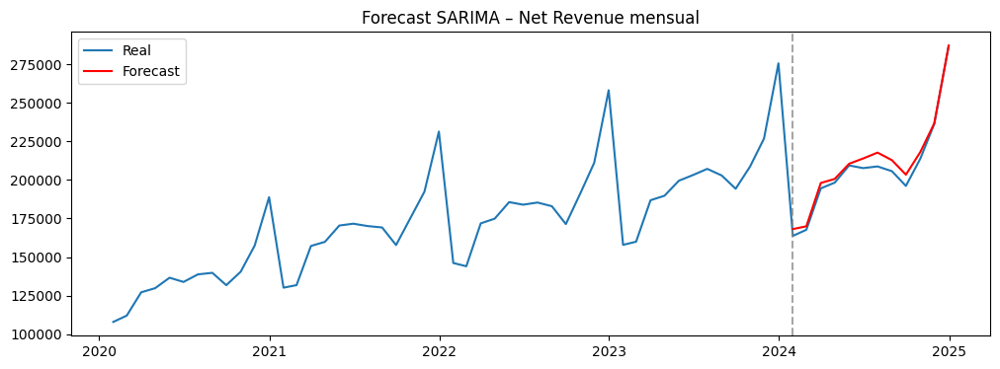
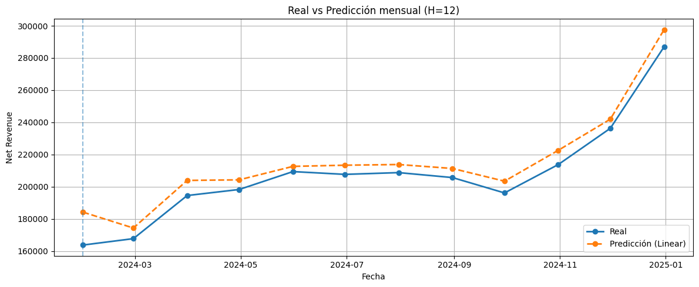
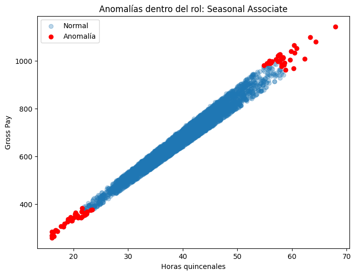
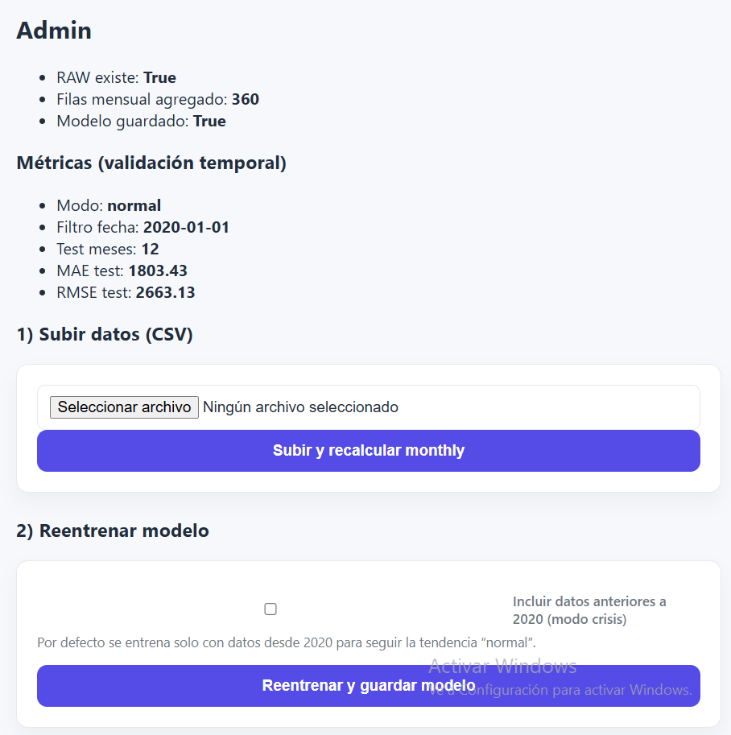

# 📈 Sales Forecasting & Payroll Analytics

Proyecto de **predicción de ingresos mensuales** basado en datos históricos de ventas, complementado con **análisis avanzado de payroll**, que cubre todo el ciclo de un proyecto de *Data Science*:

**EDA → Feature Engineering → Modelado → Validación → Forecast → Despliegue web**

---

## 🧠 Objetivo del proyecto

Desarrollar un sistema capaz de:

- Predecir **ingresos mensuales futuros** a partir de datos históricos.
- Escalar a **múltiples tiendas y canales** en un único modelo.
- Mantener un **pipeline reproducible y realista** para un entorno empresarial.
- Analizar el **dataset de payroll** para control de calidad y segmentación salarial.
- Exponer los resultados mediante una **aplicación web funcional**.

---

## 📂 Datasets utilizados

### Ventas
- Nivel diario
- Segmentación por **tienda** y **canal**
- Variables clave: `net_revenue`, `transactions`, `date`

### Payroll
- Nivel quincenal por empleado
- Variables salariales y de retenciones
- Usado para análisis independiente (no integrado en el forecast final)

---

## 🔍 Análisis Exploratorio de Datos (EDA)

### EDA de Ventas

- Evolución temporal de ingresos
- Identificación de **tendencia y estacionalidad anual**
- Alta correlación entre `net_revenue` y `transactions`
- Diferencias claras por tienda y canal

  

> El EDA justificó el uso de **granularidad mensual** y la exclusión de datos **anteriores a 2020** para evitar distorsiones estructurales.

---

### EDA de Payroll

- Distribución de salarios y horas trabajadas
- Evolución del coste laboral
- Relación payroll–ventas (exploratoria)
- Base para detección de anomalías

  

---

## ⏱️ Modelos de predicción evaluados

### 1️⃣ SARIMA – Baseline de series temporales

- Serie mensual agregada de `net_revenue`
- Transformación logarítmica
- Test de estacionariedad (ADF)
- Modelo seleccionado mediante `auto_arima`

**Modelo final**

SARIMA(1,0,0)(0,1,0)[12]

**Resultados (test 12 meses):**
- RMSE ≈ 4.879
- MAE ≈ 4.002

  

✔️ Buen baseline  
❌ Difícil de escalar a múltiples tiendas y variables

---

## 🤖 Enfoque de Machine Learning (modelo final)

Se implementó un modelo **multiserie supervisado**, capaz de predecir todas las combinaciones tienda–canal en un único pipeline.

### Feature Engineering

- **Lags**: `lag_1`, `lag_3`, `lag_6`, `lag_12`
- **Rolling means**: `roll_3`, `roll_6`, `roll_12`
- Variables categóricas: tienda, canal, mes
- Variable derivada: `avg_ticket`

---

### Modelos comparados

- Linear Regression
- Random Forest
- XGBoost (+ tuning)

📌 **Modelo seleccionado: Linear Regression**

Motivo:
- Mejor rendimiento en test
- Menor sobreajuste
- Alta interpretabilidad
- Mayor estabilidad en forecasting

**Resultados (test):**
- RMSE ≈ 2.663
- MAE ≈ 1.803

  

---

## 🔁 Forecasting a 12 meses

- Enfoque **recursivo**
- Recalcula lags y medias móviles usando predicciones previas
- Forecast por tienda/canal y agregado total
- No depende de variables futuras externas

  

---

## 👥 Análisis avanzado de Payroll

Bloque independiente orientado a **control de calidad del dato y análisis salarial**.

### 🔎 Detección de anomalías

- Isolation Forest global
- Isolation Forest **por rol** (más robusto)
- Identificación de empleados con patrones atípicos

  

---

### 📊 Clustering salarial

- K-Means sobre perfiles medios por empleado
- Selección de `k = 3` clusters
- Identificación de perfiles:
  - Bajo coste
  - Medio
  - Alto coste

  

📌 El payroll **no se integra en el modelo de ventas** para evitar *data leakage*, pero aporta valor analítico real.

---

## 🌐 Aplicación web

Aplicación ligera para **explotar el modelo sin notebooks**.

### Funcionalidades

- Subida de datos (CSV)
- Reentrenamiento del modelo
- Opción de incluir/excluir datos pre-2020
- Visualización de métricas (MAE, RMSE)
- Vista específica para análisis de payroll

  

---

## 🛠️ Tecnologías utilizadas

- Python
- pandas, numpy
- scikit-learn
- statsmodels, pmdarima
- matplotlib, seaborn
- XGBoost
- Flask
- HTML + CSS
- joblib

---

## 📌 Conclusiones

- El enfoque supervisado multiserie supera claramente a SARIMA.
- El EDA fue clave para decisiones metodológicas realistas.
- El proyecto cubre **todo el ciclo de Data Science**, incluyendo despliegue.
- La solución prioriza **robustez, interpretabilidad y aplicabilidad práctica**.

---

## 🚀 Líneas futuras

- Variables exógenas (festivos, promociones)
- Intervalos de confianza
- Modelos híbridos (SARIMA + ML)
- Análisis conjunto ventas–payroll
- API y versionado de modelos
